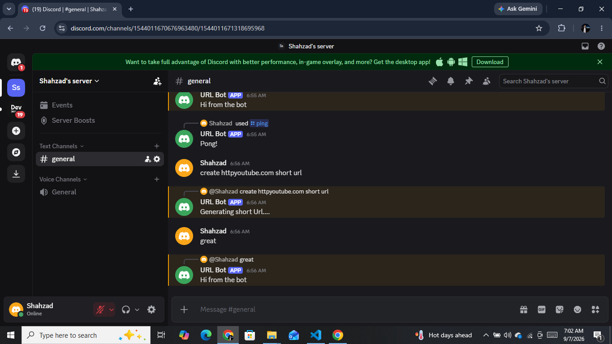

# Discord Bot

A Node.js Discord bot built with **Discord.js** to learn and demonstrate Discord bot development, message handling, slash commands, environment variables, and interaction with the Discord API.

## 📌 Overview

This project is part of my **Node.js learning journey**. It demonstrates how to create a Discord bot, connect it to a Discord server, handle incoming messages, and implement slash commands using Discord.js.

The project also follows basic production practices by keeping sensitive configuration in environment variables and separating development and production start commands.

## ✨ Features

* Connects a Node.js application to Discord
* Handles incoming Discord messages
* Ignores messages sent by bots
* Responds to regular messages
* Detects messages beginning with `create`
* Implements `/ping` slash command
* Implements `/create` slash command
* Accepts a URL as an option for `/create`
* Registers slash commands using Discord REST API
* Uses environment variables for sensitive configuration
* Uses separate development and production npm scripts

## 📸 Bot Preview



## 🛠️ Technologies

* **Node.js**
* **JavaScript**
* **Discord.js v14**
* **dotenv**
* **Discord API**
* **Discord REST API**
* **npm**

## 📂 Project Structure

```text
project-discord-bot/
│
├── command.js          # Slash command registration
├── index.js            # Main bot application
├── package.json        # Project configuration and dependencies
├── package-lock.json   # Locked dependency versions
├── .gitignore          # Ignored files and folders
└── .env                # Environment variables (not committed)
```

## ⚙️ Environment Variables

The application uses environment variables for sensitive Discord configuration.

Create a `.env` file in the project root:

```env
DISCORD_TOKEN=your_discord_bot_token
CLIENT_ID=your_discord_application_id
```

### Security

The `.env` file is excluded from Git using `.gitignore`.

**Never commit your Discord bot token to GitHub.**

## 🚀 Installation

Clone the repository:

```bash
git clone <your-repository-url>
```

Navigate into the project:

```bash
cd project-discord-bot
```

Install dependencies:

```bash
npm install
```

Create your `.env` file and add the required environment variables.

## ▶️ Running the Bot

### Development

Run the bot with Nodemon:

```bash
npm run dev
```

### Production

Run the bot using Node.js:

```bash
npm start
```

The production script runs:

```bash
node index.js
```

## 🤖 Bot Commands

### `/ping`

Tests whether the bot is responding.

**Response:**

```text
Pong!
```

### `/create`

Accepts a URL from the user.

Example:

```text
/create url:https://example.com
```

The current implementation receives and processes the provided URL. **Actual URL-shortening functionality is not yet implemented.**

## 💬 Message Handling

The bot also listens for normal Discord messages.

It:

* Ignores messages sent by other bots
* Logs received messages in the terminal
* Responds with `Hi from the bot`
* Detects messages beginning with `create`
* Responds with `Generating short Url....`

## 🔧 Slash Command Registration

Slash commands are defined and registered through `command.js`.

Run:

```bash
node command.js
```

This sends the command definitions to Discord using the REST API.

The registration script only needs to be executed when commands are created or updated; it does not need to remain running.

## 📚 Concepts Practiced

This project helped me practice:

* Node.js project initialization
* npm and package management
* Discord Developer Portal
* Discord bot creation
* Discord Gateway Intents
* Message Content Intent
* Discord.js
* Discord Client
* `messageCreate`
* `message.author.bot`
* `message.reply()`
* `interactionCreate`
* Slash commands
* Chat input commands
* Command options
* Discord REST API
* `REST`
* `Routes`
* Environment variables
* `dotenv`
* `.env`
* `.gitignore`
* Git and GitHub
* Production start scripts

## 🔐 Security Practices

Sensitive credentials are managed through environment variables instead of being hardcoded into the source code.

The following files are excluded from version control:

```text
.env
node_modules/
```

This prevents the Discord bot token and local dependencies from being uploaded to GitHub.

## 📈 Current Status

**Status: Functional**

The bot currently:

* Connects successfully to Discord
* Responds to messages
* Ignores bot messages
* Supports `/ping`
* Supports `/create`
* Accepts URL input through `/create`
* Registers slash commands through Discord's REST API
* Uses environment variables for configuration
* Has separate development and production start scripts

The project is currently being prepared for **cloud deployment**.

## 🔮 Future Improvements

Planned or possible improvements include:

* Implement actual URL-shortening functionality
* Store shortened URLs in a database
* Generate unique short URLs
* Add URL validation
* Add improved error handling
* Add additional Discord commands
* Deploy the bot to a cloud platform

## 🎯 Learning Objective

The primary objective of this project is to gain practical experience building applications with Node.js and external APIs.

The project demonstrates the progression from:

```text
Node.js
   ↓
npm & packages
   ↓
Discord.js
   ↓
Discord API
   ↓
Message & interaction handling
   ↓
Slash commands
   ↓
Environment variables
   ↓
Git & GitHub
   ↓
Cloud deployment
```

## 👨‍💻 Author

**Shahzad**

This project was developed as part of my ongoing **Node.js and backend development learning journey**.
